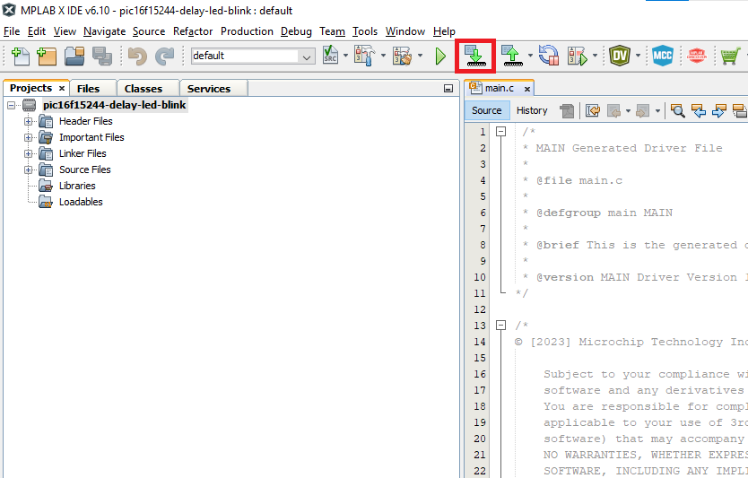

<!-- Please do not change this html logo with link -->

# Toggle an LED Using the delay() Function with PIC16F15244

The PIC16F15244 delay led blink code example uses the PIC16F15244 Curiosity Nano Development board to demonstrate how to toggle an LED using the XC8 Compiler's `delay()` function.

##### PIC16F15244 Curiosity Nano Development Board:

## Related Documentation
- [PIC16F15244 Product Page](https://www.microchip.com/wwwproducts/en/PIC16F15244)

## Software Used

* MPLAB® X IDE [v6.10.0 or newer](https://www.microchip.com/mplab/mplab-x-ide)
* XC8 Compiler [v2.41.0 or newer](https://www.microchip.com/mplab/compilers)
* MPLAB® Code Configurator (MCC) [5.3.7 or newer](microchip.com/mplab/mplab-code-configurator)](https://www.microchip.com/mplab/mplab-code-configurator)
* Microchip PIC16F1xxxx Series Device Support [1.18.352 or newer](packs.download.microchip.com/)](https://packs.download.microchip.com/)

## Hardware Used

* PIC16F15244 Curiosity Nano [EV09Z19A](https://www.microchip.com/Developmenttools/ProductDetails/EV09Z19A)
* Micro-USB to USB 2.0 cable

## Setup
1. Connect the PIC16f15244 Curiosity Nano board to a PC using the Micro-USB to USB 2.0 cable.
2. If not already on your system, download and install MPLABX IDE version 6.10 (or newer).
3. If not already on your system, download and install the XC8 C-Compiler version 2.41 (or newer).
4. Open the 'pic16f15244-delay-led-blink.X' project as shown in Figure 1.

###### Figure 1: Open Project Window

5. Press the **Project Properties** button to open the Project Properties window. Select the Curiosity tool from the Tools drop-down menu as shown in Figure 2.

###### Figure 2: Select the Nano in Project Properties Window

6. Press the **Make and Program Device** button to program the PIC (see Figure 3). Verify that the device was successfully programmed (see Figure 4).

###### Figure 3: 'Make and Program Device' Button

###### Figure 4: Program Complete

## Operation
After the Nano board is programmed, LED0 will toggle between its On and Off states every one second.

The `delay()` function is a quick and easy way to add a software delay to your code. Example 1 shows the `main()` function with a 1000 ms delay between each toggle.

###### Example 1: `Main()` Code Snippet

      void main(void)
      {
          SYSTEM_Initialize();                   // Initialize the device

          while (1)
          {
              LED0_SetDigitalInput();            // Turn LED OFF
              __delay_ms(1000);                  // One second delay
              LED0_SetDigitalOutput();           // Turn LED ON
              __delay_ms(1000);                  // One second delay
          }
      }

## Summary
The 'pic16f15244-delay-led-blink' code example uses the PIC16F15244 Curiosity Nano Development board to demonstrate how toggle an LED using the XC8 Compiler's `delay()` function. Once programmed, LED0 on the Nano board will toggle between its 'ON' and 'OFF' states every one second.
